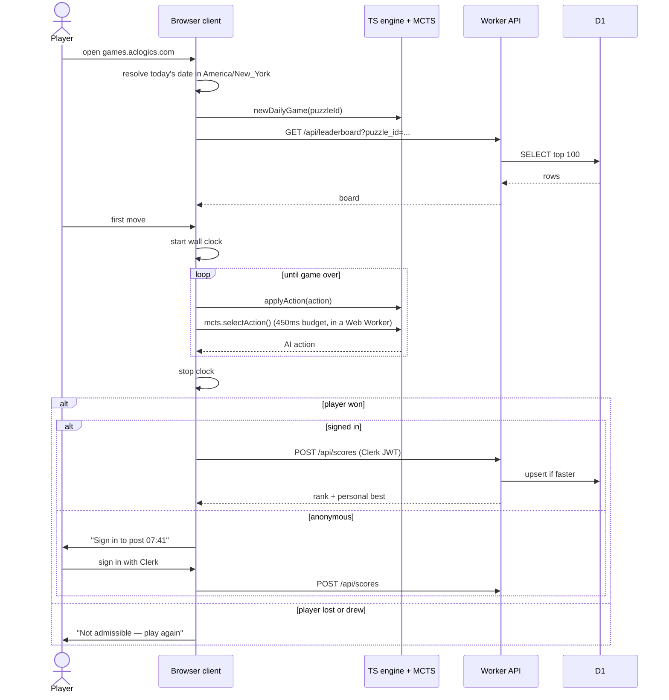
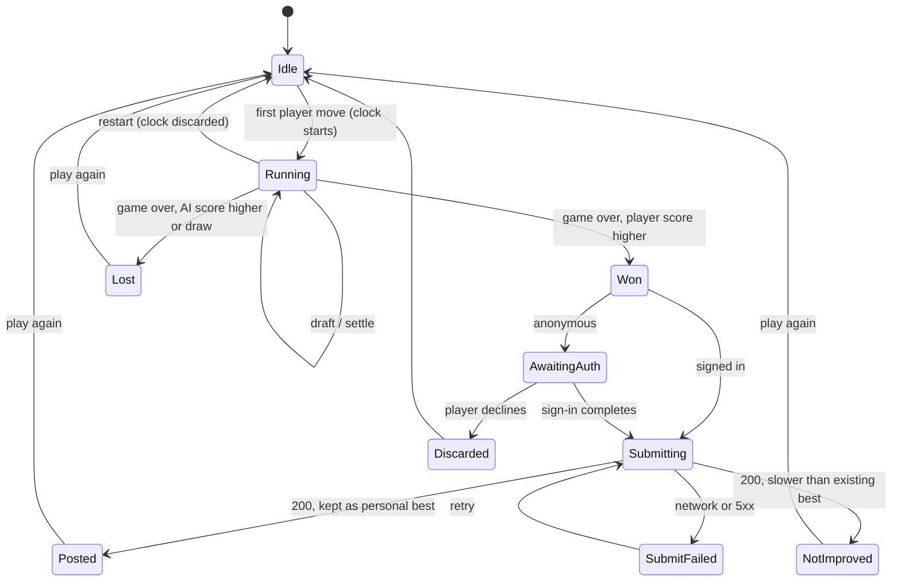
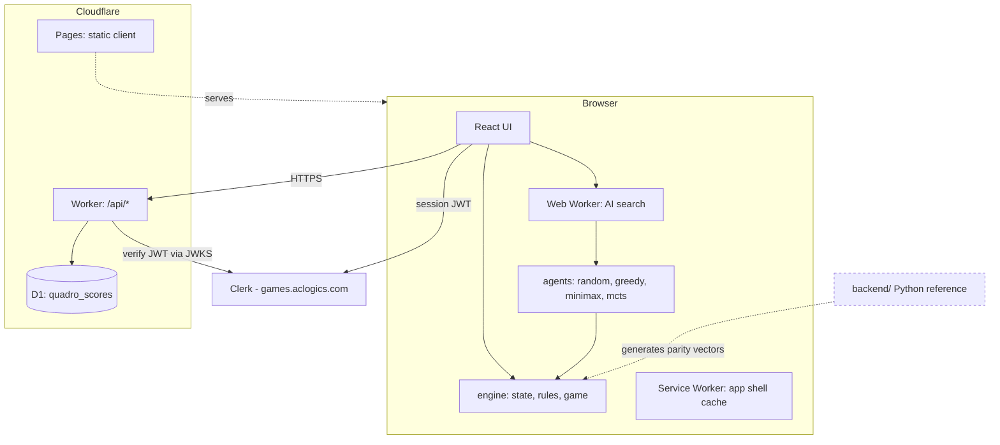

# Build Spec — Quadro browser client, Practice and Daily Challenge

- **Status:** Draft
- **Date:** 2026-08-28
- **Planned software version:** v1.0.0
- **Feature slug:** `web-ts-daily-challenge`
- **Companion document:** [PRESS-RELEASE.md](PRESS-RELEASE.md)
- **Repository:** `/Users/huajun/Code/Azul` (branch `main`)
- **New code location:** `web/` (new top-level directory)

## 1. Context Summary

Quadro is a two-player tile-drafting game. The rules engine, four AI agents and a
FastAPI session server exist in Python under `backend/`; a thin React client
exists under `frontend/`. This feature reimplements the engine and the four
classic agents in TypeScript so the entire game runs in the browser, retires the
Python server from the runtime path, and adds two product surfaces: **Practice**
(offline, unranked, any AI level, any seed) and **Daily** (one fixed deal per New
York day against the MCTS agent, timed, with a global fastest-win leaderboard).

Persistence is a Cloudflare Worker over a D1 database. Identity is Clerk on
`games.aclogics.com`. Sign-in is required only to submit a score.

The customer, problem and rationale are in [PRESS-RELEASE.md](PRESS-RELEASE.md);
this document is the implementation contract.

## 2. Confirmed Decisions

| ID | Decision |
|---|---|
| D-001 | Planned software version is **v1.0.0**. |
| D-002 | New code lives in a new `web/` directory inside this repository. `backend/` is **kept** as the reference implementation and parity oracle. `frontend/` is retired (see D-021). |
| D-003 | No Python at runtime. No PvP of any kind (online or hot-seat). |
| D-004 | AzulZero / AlphaZero (`backend/zero/`, `backend/ai/azulzero_agent.py`) is **out of scope** and must not appear in the client build or its UI. |
| D-005 | "Offline training" means **human solo practice**, not machine learning. No in-browser AI training or self-play learning is built. |
| D-006 | Practice mode: any of the four levels, any seed, results are **never** stored or submitted. |
| D-007 | Daily mode: one deal per calendar day, seeded deterministically from the date, identical for every player. |
| D-008 | The Daily day boundary is **midnight America/New_York**, DST-aware. |
| D-009 | The Daily opponent is **only** `mcts`. No other level is selectable in the Daily. |
| D-010 | A Daily attempt is admissible for the leaderboard **only if the player defeats the MCTS agent**. Losses and draws are inadmissible. |
| D-011 | Unlimited retries per day. Only the player's **fastest admissible time** is kept. |
| D-012 | Timing is **total wall clock including AI thinking time**, from the start of the attempt to game over. |
| D-013 | MCTS keeps its **time-budget** formulation (450ms per move), matching `backend/ai/mcts_agent.py`. Device-dependent strength variance is accepted. |
| D-014 | **No undo in any mode.** Practice and Daily both forbid it. Restart is allowed (and resets the Daily clock). |
| D-015 | Anti-cheat posture is **trust the client** for v1.0.0. The Worker authenticates and writes; it does not revalidate. |
| D-016 | Clerk sign-in is required **only to submit a score or view your own rank**. Play is anonymous. |
| D-017 | Deployment is **Cloudflare Pages** (static client) + **Cloudflare Workers** (API) + **Cloudflare D1** (scores). |
| D-018 | Leaderboard scope for v1.0.0 is **today's global board only**. No historic-day boards, no all-time board, no streaks, no per-player history. |
| D-019 | UI language is **English only**. No i18n framework. |
| D-020 | The game must be **playable with no network**. Offline results are **not** queued, stored or later submitted — they are simply not recorded. |
| D-021 | `frontend/` is not migrated in place; `web/` is a fresh application. `frontend/` may be deleted in a follow-up commit but its deletion is not part of this feature's acceptance. |

## 3. Assumptions

| ID | Assumption | If wrong |
|---|---|---|
| A-001 | In the Daily the human is seat 0 (`player 0`) and moves first, always. | The Daily deal generation and all recorded times change meaning; regenerate the day's puzzle id. |
| A-002 | The leaderboard display name is the Clerk profile's username, falling back to first name, falling back to a truncated user id. No in-app name editing. | Adds a profile surface and a name-moderation question. |
| A-003 | A new, documented TypeScript PRNG defines the Daily deal. The Python `random.Random` (Mersenne Twister) stream is **not** reproduced; a given seed produces different deals in Python and TypeScript, and that is fine because the Daily is defined by the TypeScript engine. | Requires a faithful MT19937 + `_randbelow` port to keep Python and TS deals identical. |
| A-004 | Rate limiting on score submission is per authenticated user, enforced in the Worker at 60 submissions/hour. | Tune the constant; no structural change. |
| A-005 | Only 2-player games exist, as in `backend/engine/constants.py` (`NUM_PLAYERS = 2`). | Out of scope for v1.0.0. |
| A-006 | Offline capability is delivered with a Vite-generated service worker precaching the app shell; installability (PWA manifest) is included because it is nearly free, but is not an acceptance requirement. | Drop the manifest; keep the service worker. |

## 4. Open Questions

None blocking. All items in §3 are implementable as stated; raise them only if the
implementer finds evidence against them.

## 5. Repository Facts That Constrain This Work

| Path / symbol | Fact | Consequence |
|---|---|---|
| `backend/engine/constants.py` | Geometry, penalties, bonuses, and the action encoding `(source*5 + color)*6 + dest`, 180 total actions. | Port verbatim. `web/src/engine/constants.ts` must produce identical action ids. |
| `backend/engine/state.py` — `Action`, `PlayerBoard`, `GameState` | Bag and discard are **per-color counts**, not shuffled sequences; the state serializes losslessly to JSON. | The TS state mirrors this shape; the serialized form is the parity-vector format. |
| `backend/engine/rules.py` — `legal_actions`, `is_legal`, `preview`, `apply_action`, `undo_action`, `score_placement`, `settle_round`, `final_scoring`, `decide_winner` | Pure functions over `GameState`; `apply_action` returns an `Undo` record used by search, not by the UI. | Port all of them. `undo_action` is needed by minimax/MCTS even though D-014 forbids player-facing undo. |
| `backend/engine/game.py` — `draw_tile`, `start_round`, `settle_and_deal`, `QuadroGame` | The only RNG consumer is `draw_tile` via `state.rng.randrange(total)`. Bag empty → refill from discard; both empty → displays left short. | RNG is isolated to one function. A-003's PRNG plugs in exactly here. |
| `backend/engine/constants.py` — `MAX_ROUNDS = 150` | Termination guard used by tests. | Keep it in the TS engine and in fuzz tests. |
| `backend/ai/base.py`, `registry.py` | `Agent` interface with `level` and a seedable constructor; `available_levels()` gates AzulZero on weights. | The TS registry exposes exactly four levels (D-004); no gating logic needed. |
| `backend/ai/evaluate.py` — `Weights`, `DEFAULT_WEIGHTS`, `side_value`, `evaluate` | Shared heuristic used by greedy, minimax and MCTS rollouts. | Port first; every other agent depends on it. Floating-point ordering differences will change tie-breaks — see §14. |
| `backend/ai/minimax_agent.py` | Alpha-beta **inside the round**, iterative deepening to depth 4, with a `SearchTimeout`. | The TS port needs the same wall-clock cutoff, using `performance.now()`. |
| `backend/ai/mcts_agent.py` | Open-loop determinized UCT, `time_budget=0.45`, `tree_width=12`, `rollout_epsilon=0.15`, `rollout_width=6`, `rollout_rounds=2`, `VALUE_SCALE=25.0`. Redraws the deal when a playout crosses a round boundary. | Port constants exactly. The redraw uses the agent's own RNG, not the game RNG. |
| `docs/ai_benchmarks.md` | Greedy 100% vs Random; Minimax(d4) 88.5% vs Greedy; MCTS(450ms) 67.9% vs Minimax. Max move time ≤ 500ms for all. | These are the port's strength targets (§14, AC-030). |
| `frontend/src/types/game.ts` | Already mirrors the protocol; `actionId()` duplicates the backend encoding; UI strings are Chinese. | Useful as a naming reference only. D-019 means all copy is rewritten in English. |
| `frontend/src/components/*` | `PlayerBoard`, `DisplayArea`, `Tile`, `TopBar`, `SetupScreen` — DOM/SVG, Tailwind, ~360 lines total. | Visual reference for the new components. Reimplement against the local engine, not a socket. |
| `backend/tests/` | 103 tests, 99% engine coverage, including a fuzz pass asserting tile conservation, non-negative scores, no color repeats per row/column, exactly one first-player token. | These invariants are re-asserted in the TS test suite, and the Python suite generates the parity vectors (§14). |
| `backend/app/`, `docs/protocol.md` | The WebSocket protocol and server-side game manager. | **Dead for this feature.** No client code may reference them. |

## 6. Personas and Roles

| Role | Auth | Can play Practice | Can play Daily | Can submit a time | Can see the board |
|---|---|---|---|---|---|
| Anonymous visitor | none | Yes | Yes | No — prompted to sign in | Yes (read-only, no own rank) |
| Signed-in player | Clerk session | Yes | Yes | Yes | Yes, with own rank highlighted |
| Offline visitor | n/a | Yes | Yes, if the day's puzzle is already cached | No | No — board shows an offline notice |

There are no admin or moderator roles in v1.0.0.

## 7. End-to-End Flows

### 7.1 Daily attempt



### 7.2 Attempt state machine



### 7.3 System architecture



## 8. The Daily Puzzle Definition

### 8.1 Day boundary and puzzle id

- `puzzle_id` is the calendar date in `America/New_York`, formatted `YYYY-MM-DD`.
- Resolve it with `Intl.DateTimeFormat('en-CA', { timeZone: 'America/New_York' })`,
  which yields `YYYY-MM-DD` directly and is DST-correct. Never compute it with a
  fixed UTC offset.
- The client re-resolves the date on focus and at least once a minute while the
  Daily screen is open; when it changes, the client offers a new puzzle rather
  than silently swapping the board mid-attempt.
- The Worker independently resolves the current `puzzle_id` the same way and
  rejects submissions for any other date (§11, BR-012).

### 8.2 Seed derivation

```
seed = fnv1a32("quadro-daily-v1:" + puzzle_id)
```

FNV-1a 32-bit, offset basis `0x811c9dc5`, prime `0x01000193`, applied over the
UTF-8 bytes, result kept as an unsigned 32-bit integer. The version prefix exists
so the deal set can be regenerated in a later release without colliding with
posted times.

### 8.3 Deterministic PRNG

`web/src/engine/rng.ts` implements `mulberry32(seed: number)` exposing
`next(): number` in `[0, 1)` and `nextInt(n: number): number` as
`Math.floor(next() * n)`. It is the **only** source of randomness in the engine,
consumed solely by `drawTile` (mirroring `backend/engine/game.py:draw_tile`).
Per A-003 this deliberately does not reproduce Python's stream.

### 8.4 AI determinism

The Daily's MCTS agent is constructed with seed `seed ^ 0x9e3779b9`. Because
D-013 keeps the 450ms time budget, the number of simulations — and therefore the
chosen move — still varies with device speed. The seed makes a given machine
reproducible; it does not make all machines identical. This is a known and
accepted consequence of D-013 and must be stated in the Daily UI's help text
(FR-024).

## 9. UI Surfaces and States

### 9.1 Screens

| Screen | Route | Contents |
|---|---|---|
| Home | `/` | Two entry cards: Daily and Practice. Today's date, whether you have a posted time, sign-in state. |
| Daily | `/daily` | Board, timer, opponent label ("Monte Carlo"), restart, live leaderboard panel. |
| Practice | `/practice` | Setup (level, seed or random) then the board. Clear "not recorded" marker. |
| Leaderboard | `/leaderboard` | Today's global board, Top 100, own rank pinned. Reachable standalone and as a panel from `/daily`. |

Routing is client-side. Cloudflare Pages must serve `index.html` for unknown
paths (SPA fallback) so deep links work.

### 9.2 Board interaction

Two-step selection, as in the existing client: click a color group in a display
or the center, then click a highlighted destination (staging row 0–4 or the
penalty row). Legality comes from the local engine's `legalActions()`. Illegal
targets are never clickable. Keyboard equivalents: arrow keys move a focus ring,
Enter selects, Escape clears the pending selection.

### 9.3 Required states per surface

| Surface | States that must be designed and implemented |
|---|---|
| Board | idle, your turn, pending selection, AI thinking (with a visible indicator, since it counts against your clock), round settling animation, game over |
| Timer | not started, running, stopped (final), reset on restart |
| Leaderboard panel | loading, populated, empty ("nobody has beaten it yet today"), offline, request failed with retry, own-rank-not-present |
| Submission | signed-in submitting, awaiting sign-in, posted with rank, not improved on personal best, failed with retry |
| Practice setup | default, custom seed entered, invalid seed input |
| Global | offline banner, service-worker update available |

## 10. Functional Requirements

### Engine and AI port

| ID | Requirement |
|---|---|
| FR-001 | `web/src/engine/` provides a TypeScript port of `backend/engine/` with the same public surface: `Action`, `PlayerBoard`, `GameState`, `legalActions`, `isLegal`, `preview`, `applyAction`, `undoAction`, `scorePlacement`, `settleRound`, `finalScoring`, `decideWinner`, `drawTile`, `startRound`, `settleAndDeal`, and a `QuadroGame` driver. |
| FR-002 | Action ids are computed as `(source * 5 + color) * 6 + dest`, identical to `Action.action_id`, with a matching `Action.fromId`. |
| FR-003 | The engine has **zero** runtime dependencies and no DOM or network references, so it can run inside a Web Worker and inside Node for tests. |
| FR-004 | The engine emits the same event kinds as `backend/engine/events.py`: `Draft`, `TileScored`, `PenaltyApplied`, `RoundEnd`, `RoundStart`, `BonusAwarded`, `GameEnd`. |
| FR-005 | `GameState` serializes to and from JSON losslessly, in the same shape as the Python `to_dict`/`from_dict`, so parity vectors are directly comparable. |
| FR-006 | `web/src/ai/` provides `random`, `greedy`, `minimax` and `mcts` agents plus the shared `evaluate` module, ported from `backend/ai/` with the same tuning constants. |
| FR-007 | The agent registry exposes exactly these four levels. `azulzero` must not be referenced anywhere in `web/`. |
| FR-008 | AI search runs in a Web Worker so the UI thread stays responsive; the worker receives a serialized `GameState` and returns an action id. |
| FR-009 | Minimax and MCTS enforce their wall-clock budgets with `performance.now()` and must return a legal action even if the budget expires before the first iteration completes. |

### Practice mode

| ID | Requirement |
|---|---|
| FR-010 | Practice lets the player choose any of the four AI levels. |
| FR-011 | Practice lets the player enter an explicit integer seed or take a random one; the seed in use is always displayed so a deal can be replayed. |
| FR-012 | Practice results are never persisted, never transmitted, and never appear on any leaderboard. |
| FR-013 | Practice offers no undo (D-014). Restart and "new deal" are offered instead. |
| FR-014 | Practice is fully functional with no network connection. |
| FR-015 | The Practice screen states plainly that nothing is recorded. |

### Daily mode

| ID | Requirement |
|---|---|
| FR-016 | The Daily generates its deal from the derivation in §8; the same `puzzle_id` always produces the same starting position on every device. |
| FR-017 | The Daily opponent is fixed to `mcts`; no level selector is shown. |
| FR-018 | The wall clock starts when the player commits their first action and stops when the engine reports game over. AI thinking time is included (D-012). |
| FR-019 | Elapsed time is displayed live, formatted `mm:ss.mmm`, and recorded in integer milliseconds. |
| FR-020 | Restarting the Daily discards the current attempt and its clock entirely; no partial attempt is ever submitted. |
| FR-021 | An attempt is admissible only when `decideWinner` names the human (seat 0) the sole winner. A draw is inadmissible. |
| FR-022 | The Daily offers no undo (D-014). |
| FR-023 | A player may attempt the day's puzzle any number of times. |
| FR-024 | The Daily screen explains, in one line, that the opponent's move choice can vary slightly with device speed because it thinks for a fixed 450ms per move. |
| FR-025 | If the New York date changes while a Daily attempt is in progress, the attempt continues under its original `puzzle_id`; the client shows a "a new Daily is available" prompt rather than swapping the board. A submission for a stale `puzzle_id` will be rejected by the Worker (BR-012), and the client must surface that rejection as "this attempt belongs to yesterday's puzzle". |

### Identity and submission

| ID | Requirement |
|---|---|
| FR-026 | Clerk is configured for `games.aclogics.com`. Sign-in and sign-out are reachable from every screen. |
| FR-027 | No screen requires sign-in to render or to play. |
| FR-028 | On an admissible win by an anonymous player, the client offers sign-in and, on success, submits the attempt held in memory. |
| FR-029 | Submission sends `{ puzzle_id, elapsed_ms, final_score, opponent_score, rounds, client_version }` with the Clerk session JWT in `Authorization: Bearer`. |
| FR-030 | The Worker keeps at most one row per `(user_id, puzzle_id)` and replaces it only when the new `elapsed_ms` is strictly smaller. |
| FR-031 | A submission response tells the client the stored best time and the resulting rank; the UI distinguishes "new personal best, rank N" from "not faster than your NN:NN". |
| FR-032 | If submission fails, the attempt is held in memory and a retry control is shown. It is discarded on page unload — nothing is queued to disk (D-020). |

### Leaderboard

| ID | Requirement |
|---|---|
| FR-033 | The board shows today's global fastest admissible times, ascending, Top 100. |
| FR-034 | Each row shows rank, display name, and time. Final score is shown as a secondary column. |
| FR-035 | A signed-in player outside the Top 100 sees their own row pinned below the list with their true rank. |
| FR-036 | The board can be read without signing in. |
| FR-037 | When offline, the board area shows an offline state, not an error, and does not block play. |
| FR-038 | Ties on `elapsed_ms` break by earliest `created_at`. |

## 11. Business Rules

| ID | Rule |
|---|---|
| BR-001 | One puzzle per `America/New_York` calendar day; `puzzle_id = YYYY-MM-DD`. |
| BR-002 | `seed = fnv1a32("quadro-daily-v1:" + puzzle_id)`. |
| BR-003 | The human is seat 0 and moves first in the Daily (A-001). |
| BR-004 | The Daily opponent is `mcts` with `time_budget = 0.45`. |
| BR-005 | Only a sole win by seat 0 is admissible. |
| BR-006 | Timing is total wall clock, AI thinking included. |
| BR-007 | Best-of-many: the smallest admissible `elapsed_ms` per player per day is kept. |
| BR-008 | Practice never writes to D1. |
| BR-009 | No undo in any mode. |
| BR-010 | Only signed-in users may write to D1. |
| BR-011 | The Worker rejects `elapsed_ms < 20000` or `elapsed_ms > 7200000` as implausible. A full game is five rounds against a 450ms-per-move agent; sub-20-second wins are not physically reachable. Rejections return `422` with `code: "IMPLAUSIBLE_TIME"`. |
| BR-012 | The Worker rejects any `puzzle_id` that is not the current New York date, with `409` and `code: "STALE_PUZZLE"`. |
| BR-013 | Per-user rate limit of 60 submissions per rolling hour; over-limit returns `429`. |
| BR-014 | Scores older than 90 days are deleted by a scheduled job (§13). |
| BR-015 | Beyond BR-011 and BR-013, submitted values are trusted (D-015). |

## 12. Data Model

### 12.1 D1 schema

```sql
CREATE TABLE IF NOT EXISTS scores (
  id            INTEGER PRIMARY KEY AUTOINCREMENT,
  puzzle_id     TEXT    NOT NULL,          -- 'YYYY-MM-DD' in America/New_York
  user_id       TEXT    NOT NULL,          -- Clerk user id (sub claim)
  display_name  TEXT    NOT NULL,
  elapsed_ms    INTEGER NOT NULL,
  final_score   INTEGER NOT NULL,
  opponent_score INTEGER NOT NULL,
  rounds        INTEGER NOT NULL,
  client_version TEXT   NOT NULL,
  created_at    INTEGER NOT NULL,          -- epoch ms, server-assigned
  updated_at    INTEGER NOT NULL,
  UNIQUE (puzzle_id, user_id)
);

CREATE INDEX IF NOT EXISTS idx_scores_board
  ON scores (puzzle_id, elapsed_ms ASC, created_at ASC);

CREATE TABLE IF NOT EXISTS submissions_audit (
  id         INTEGER PRIMARY KEY AUTOINCREMENT,
  puzzle_id  TEXT    NOT NULL,
  user_id    TEXT    NOT NULL,
  elapsed_ms INTEGER NOT NULL,
  accepted   INTEGER NOT NULL,             -- 0/1
  reason     TEXT,                         -- rejection code when accepted = 0
  created_at INTEGER NOT NULL
);

CREATE INDEX IF NOT EXISTS idx_audit_user_time
  ON submissions_audit (user_id, created_at DESC);
```

`submissions_audit` exists to make BR-013 enforceable without a KV counter and to
give a forensic trail if the board is polluted. It is append-only.

### 12.2 Ownership, retention, deletion

- A `scores` row is owned by its Clerk `user_id`. `display_name` is a
  denormalized copy taken at submission time, refreshed on each accepted write.
- The only personal data stored is the Clerk user id and the chosen display name.
  No email, no IP, no device fingerprint.
- Retention: 90 days for both tables (BR-014).
- Deletion: a `DELETE /api/me` endpoint removes every `scores` and
  `submissions_audit` row for the authenticated user and returns the count. This
  is the account-deletion path; it is required, not optional.

### 12.3 Client-side storage

`localStorage` holds only conveniences: last chosen Practice level, last Practice
seed, and the `puzzle_id` of the last Daily the player finished (for the home
screen's "you've played today" marker). All reads and writes are wrapped in
`try/catch` and the app must render correctly with none of it present. No game
state and no unsent scores are persisted (D-020, FR-032).

## 13. API Contracts

Base path `/api`. All responses are JSON. All errors use
`{ "error": { "code": string, "message": string } }`.

### `GET /api/daily`

Returns the current puzzle descriptor so the client can cross-check its own date
resolution. No auth.

```json
{ "puzzle_id": "2026-08-28", "seed": 2463534242, "opponent": "mcts",
  "next_rollover_ms": 1756440000000 }
```

### `GET /api/leaderboard?puzzle_id=YYYY-MM-DD&limit=100`

No auth. `puzzle_id` defaults to today. `limit` is clamped to 1..100.

```json
{
  "puzzle_id": "2026-08-28",
  "entries": [
    { "rank": 1, "display_name": "ada", "elapsed_ms": 461230,
      "final_score": 64, "opponent_score": 51 }
  ],
  "total_entries": 37,
  "me": { "rank": 112, "elapsed_ms": 903118 }
}
```

`me` is present only when a valid Clerk JWT accompanies the request and the user
has a row for that puzzle; otherwise it is `null`.

### `POST /api/scores`

Requires `Authorization: Bearer <Clerk session JWT>`.

Request:

```json
{ "puzzle_id": "2026-08-28", "elapsed_ms": 461230, "final_score": 64,
  "opponent_score": 51, "rounds": 5, "client_version": "1.0.0" }
```

Success `200`:

```json
{ "accepted": true, "improved": true, "best_elapsed_ms": 461230,
  "rank": 1, "total_entries": 38 }
```

`improved: false` with the existing `best_elapsed_ms` when the submission was
slower (still `200` — this is not an error).

Errors: `401 UNAUTHENTICATED`, `409 STALE_PUZZLE` (BR-012), `422 IMPLAUSIBLE_TIME`
(BR-011), `422 INVALID_PAYLOAD` (schema violation, or `final_score <=
opponent_score` which contradicts an admissible win), `429 RATE_LIMITED`
(BR-013), `500 INTERNAL`.

### `DELETE /api/me`

Requires auth. Deletes all rows for the user. Returns
`{ "deleted_scores": n, "deleted_audit": m }`.

### Scheduled Worker

A cron trigger (`0 5 * * *`, i.e. ~midnight New York year-round) deletes rows
older than 90 days from both tables (BR-014).

### Clerk verification

The Worker verifies the session JWT against Clerk's JWKS for the
`games.aclogics.com` instance, caching the JWKS in memory for the isolate's
lifetime with a 10-minute revalidation. It checks `iss`, `exp`, `nbf` and `azp`
against the configured frontend origin, and takes `user_id` from `sub`.
`display_name` comes from the request-time Clerk claim per A-002. The Clerk
secret key and instance issuer are Worker secrets; the publishable key is a build
-time public variable for the client.

## 14. Port Parity Strategy

This is the highest-risk part of the work and is a release gate.

1. **Vector generation.** A new script `backend/scripts/export_vectors.py` writes
   JSON fixtures into `web/test/vectors/`. Each vector is
   `{ state, action_ids, expected_states, expected_events }` — a serialized
   `GameState`, a sequence of actions, and the serialized state and events after
   each one. Because the vectors carry explicit actions and explicit states, they
   are **RNG-independent**, so A-003's different PRNG does not weaken them.
2. **Coverage.** Vectors must cover: every case in `backend/tests/test_rules.py`
   and `test_scoring.py`; at least 200 complete games played by `greedy` vs
   `random` from distinct Python seeds; and every edge case named in
   [docs/plans/01-engine.md](../../plans/01-engine.md) (bag refill from discard,
   both empty, staging row color lock, penalty overflow to discard, first-player
   token accounting, tie on complete rows).
3. **TS-side test.** `web/test/parity.test.ts` loads every vector, replays it
   through the TS engine and asserts deep equality of state and events at each
   step. Any mismatch fails CI.
4. **Invariant fuzz.** `web/test/fuzz.test.ts` mirrors the Python fuzz pass:
   random legal play, asserting tile conservation (100 tiles plus the token
   always accounted for), scores never negative, no color repeated in a grid row
   or column, exactly one first-player token, and termination within
   `MAX_ROUNDS`.
5. **Agent strength.** `web/test/strength.bench.ts` (run manually, not in CI)
   plays the TS agents against each other and must reproduce the ordering in
   `docs/ai_benchmarks.md`: greedy > 90% vs random, minimax(d4) > 65% vs greedy,
   mcts(450ms) ≥ 55% vs minimax. Results are appended to
   `web/docs/ts_ai_benchmarks.md`.
6. **Floating point.** `evaluate` and the agents use `number` (float64) as Python
   uses float64, so values agree; but tie-breaking between equal-valued actions
   depends on iteration order. Agent move choice is therefore **not** part of the
   parity assertion — only engine state transitions are. Agent quality is
   asserted statistically by step 5.
7. **Move-time budget.** Measure the median and max per-move wall time for
   minimax and mcts in Chrome and Safari on a mid-range phone. If MCTS at 450ms
   achieves fewer than 40% of the simulation count the Python agent achieves,
   record it in `web/docs/ts_ai_benchmarks.md` and raise it with the product owner
   before release (see the press release's third risk).

## 15. Error, Offline and Edge Behavior

| Situation | Behavior |
|---|---|
| No network on load, app shell cached | Home, Practice and Daily render. The leaderboard area shows "Offline — scores aren't recorded right now." Play proceeds. |
| No network on load, nothing cached | Browser's own offline page. Nothing to do. |
| Network lost mid-Daily | The attempt continues. On a win, submission is attempted; on failure, FR-032's retry control appears. Nothing is queued to disk. |
| Clerk unreachable | Play is unaffected. Sign-in controls show "Sign-in unavailable". Submission is disabled with that reason. |
| JWT expired at submit time | Client refreshes the Clerk session once and retries once; if that fails, it prompts re-sign-in and keeps the attempt in memory. |
| Worker 5xx | Retry control, with exponential backoff on automatic retries (2 attempts, 1s and 3s) before surfacing manual retry. |
| Two tabs, same Daily | Both run independent attempts. Submission is last-write-wins under BR-007 (only a faster time replaces). No cross-tab coordination. |
| Clock skew between device and Worker | The Worker's `puzzle_id` is authoritative (BR-012); the client shows the resulting `STALE_PUZZLE` rejection as a dated explanation, not a generic error. |
| AI worker crashes or fails to load | The game falls back to running the agent on the main thread, with a visible "performance may be reduced" note. If that also fails, the attempt is abandoned with an explicit error; it is never auto-submitted. |
| Player closes the tab mid-attempt | The attempt is lost. No resume. |
| Service worker has a new build | A non-blocking "Update available — reload" banner. It must never reload during a running Daily attempt. |
| Malformed or hostile submission payload | `422 INVALID_PAYLOAD`, logged to `submissions_audit` with `accepted = 0`. |

## 16. Non-Functional Requirements

| ID | Requirement |
|---|---|
| NFR-001 | First contentful paint under 2s on a mid-range phone over 4G; the initial JS bundle (engine + UI, excluding the AI worker chunk) under 250KB gzipped. |
| NFR-002 | The AI worker chunk loads lazily, before the first AI turn, not on page load. |
| NFR-003 | UI stays responsive during AI search: no main-thread task over 50ms attributable to search. |
| NFR-004 | Per-move AI time stays within its budget: minimax and mcts ≤ 600ms wall clock at the 99th percentile on target devices. |
| NFR-005 | The leaderboard `GET` responds in under 200ms at the Worker (D1 query time), served from the index in §12.1. |
| NFR-006 | Accessibility: all interactive elements keyboard-reachable with visible focus; tiles are distinguishable by shape or label as well as color (color-blind safety is non-negotiable for a five-color game); the timer is an `aria-live="off"` region updated politely at end of game only, to avoid screen-reader spam. |
| NFR-007 | Board and leaderboard render correctly at 375px width and above; no horizontal page scroll. |
| NFR-008 | No third-party analytics, no cookies beyond Clerk's own session cookie. |
| NFR-009 | Content Security Policy on Pages allows only self, the Worker origin and Clerk's domains. |
| NFR-010 | Secrets (Clerk secret key, D1 binding) exist only as Worker secrets and bindings; no secret is ever present in client code. |
| NFR-011 | The client works in current Chrome, Safari, Firefox and Edge, and on iOS Safari 16+. |

## 17. Analytics

No third-party analytics (NFR-008). Operational signal comes from Worker logs and
the `submissions_audit` table:

| Signal | Source |
|---|---|
| Daily participation | distinct `user_id` per `puzzle_id` in `scores` |
| Submission rejection mix | `submissions_audit` grouped by `reason` |
| Return rate | users appearing on multiple consecutive `puzzle_id` values |
| API health | Worker request logs (status, duration) via Cloudflare observability |

Client-side gameplay funnels (attempts started vs finished) are **not** measured
in v1.0.0, because doing so needs an events endpoint that D-018 puts out of scope.

## 18. Rollout

- No feature flags. v1.0.0 is the first public release; there is nothing to flag
  off against.
- Order of work: (1) engine port + parity vectors green; (2) agent port + strength
  bench; (3) Practice UI; (4) Daily + timer; (5) Worker + D1 + Clerk; (6)
  leaderboard UI; (7) service worker and offline states. Steps 1–3 are shippable
  as an internal preview with no backend at all.
- Migration: none. No existing users, no existing data.
- Rollback: Pages keeps prior deployments; rolling back the client is a
  deployment revert. D1 schema changes are additive only, so a client rollback
  never requires a database rollback.
- Support: a single "how the Daily works" help panel covering the New York
  rollover, the win requirement, the retry rule, and the device-speed caveat.

## 19. Test Strategy

| Layer | Scope |
|---|---|
| Engine unit (Vitest, Node) | Ported equivalents of `backend/tests/test_rules.py`, `test_scoring.py`, `test_game.py`, `test_events.py`. |
| Parity (Vitest, Node) | §14 steps 1–3, over the exported vectors. Blocking in CI. |
| Fuzz (Vitest, Node) | §14 step 4, 2,000 random games per run with a fixed seed set. |
| Agent strength (manual bench) | §14 step 5. Not in CI (too slow); run before release and on any agent change. |
| Daily determinism | Same `puzzle_id` produces byte-identical initial serialized state across Node and two browsers. |
| Timezone | Unit tests for `puzzle_id` resolution across a DST spring-forward and fall-back boundary and across the UTC date line (e.g. 03:30 UTC). |
| Worker (Vitest + Miniflare/`workers-pool`) | Every endpoint: auth pass/fail, BR-011/012/013 rejections, best-of-many upsert semantics, tie-break ordering, `DELETE /api/me`. |
| UI component (Vitest + Testing Library) | Board selection, illegal-target rejection, timer start/stop/reset, submission state machine (§7.2). |
| E2E (Playwright) | Anonymous Daily win → sign-in → post → appears on board. Practice offline. Restart discards clock. |
| Accessibility | axe pass on Home, Daily, Practice, Leaderboard; manual keyboard traversal of the board. |

## 20. Acceptance Criteria

| ID | Criterion |
|---|---|
| AC-001 | Every exported parity vector replays through the TS engine with deep-equal state and events at every step; CI fails on any mismatch. |
| AC-002 | The fuzz suite plays 2,000 games with zero invariant violations and zero games exceeding `MAX_ROUNDS`. |
| AC-003 | Action ids produced by the TS engine match `Action.action_id` for all 180 combinations. |
| AC-004 | `grep -ri azulzero web/src` returns nothing. |
| AC-005 | `web/` contains no reference to `backend/app`, `docs/protocol.md`, WebSockets, or any HTTP call other than `/api/*` and Clerk. |
| AC-006 | With the network disabled in DevTools after one successful load, Practice is fully playable start to finish. |
| AC-007 | A Practice game produces zero requests to `/api/scores`. |
| AC-008 | No undo control exists in either mode, and no keyboard shortcut performs one. |
| AC-009 | Loading `/daily` at 23:59:59 America/New_York and again at 00:00:01 yields two different `puzzle_id` values and two different initial deals. |
| AC-010 | The same `puzzle_id` yields a byte-identical serialized initial `GameState` in Node, Chrome and Safari. |
| AC-011 | `puzzle_id` resolution is correct on the DST spring-forward and fall-back days, verified by unit test. |
| AC-012 | The Daily offers no AI level selector, and the constructed agent is `mcts` with `time_budget = 0.45`. |
| AC-013 | The timer does not advance before the first player action and stops within 50ms of game over. |
| AC-014 | Restarting the Daily resets the displayed time to zero and no request is made. |
| AC-015 | A losing Daily attempt shows no submit affordance and issues no `POST /api/scores`. |
| AC-016 | A drawn Daily attempt is treated as a loss (AC-015 applies). |
| AC-017 | An anonymous winning attempt shows a sign-in offer; completing sign-in posts the same `elapsed_ms` that was displayed. |
| AC-018 | Two winning attempts on the same day, the second slower, leave the leaderboard row at the first attempt's time, and the client says "not faster than your best". |
| AC-019 | Two winning attempts, the second faster, replace the row, and exactly one row exists for `(user_id, puzzle_id)`. |
| AC-020 | `POST /api/scores` with no JWT returns `401` and writes nothing to `scores`. |
| AC-021 | `POST /api/scores` with a valid JWT but yesterday's `puzzle_id` returns `409 STALE_PUZZLE`. |
| AC-022 | `POST /api/scores` with `elapsed_ms = 5000` returns `422 IMPLAUSIBLE_TIME` and is recorded in `submissions_audit` with `accepted = 0`. |
| AC-023 | `POST /api/scores` with `final_score <= opponent_score` returns `422 INVALID_PAYLOAD`. |
| AC-024 | The 61st submission within an hour by one user returns `429`. |
| AC-025 | `GET /api/leaderboard` with no auth returns entries and `me: null`. |
| AC-026 | With a valid JWT and a rank of 112, the response includes `me.rank = 112` and the UI pins that row below the Top 100. |
| AC-027 | Two rows with equal `elapsed_ms` order by ascending `created_at`. |
| AC-028 | An empty board renders the "nobody has beaten it yet today" state, not a spinner or an error. |
| AC-029 | `DELETE /api/me` removes every row for that user across both tables and returns the counts. |
| AC-030 | The manual strength bench reproduces the ordering in `docs/ai_benchmarks.md`: greedy > 90% vs random, minimax(d4) > 65% vs greedy, mcts(450ms) ≥ 55% vs minimax, over at least 120 swapped-seat games each. |
| AC-031 | During AI search, no main-thread long task exceeds 50ms (Performance panel). |
| AC-032 | axe reports no critical or serious violations on any of the four screens. |
| AC-033 | The board is usable at 375px width with no horizontal page scroll. |
| AC-034 | Tiles are distinguishable in a grayscale screenshot. |
| AC-035 | No secret value appears in the built client bundle (`grep` for the Clerk secret key prefix returns nothing in `web/dist`). |
| AC-036 | A deep link to `/leaderboard` served by Pages returns the SPA and renders the board. |
| AC-037 | Killing the AI worker mid-game falls back to main-thread search and the game completes. |
| AC-038 | The service-worker update banner never triggers a reload while a Daily attempt is running. |

## 21. Repository Impact

### New

```
web/
  package.json  vite.config.ts  tsconfig.json  tailwind.config.js  index.html
  wrangler.jsonc                        # Worker + D1 binding + cron trigger
  src/
    engine/
      constants.ts  rng.ts  state.ts  rules.ts  events.ts  game.ts  index.ts
    ai/
      base.ts  evaluate.ts  randomAgent.ts  greedyAgent.ts
      minimaxAgent.ts  mctsAgent.ts  registry.ts
    workers/ai.worker.ts                # search off the main thread
    daily/puzzle.ts                     # puzzle_id, fnv1a32, seed derivation
    api/client.ts                       # /api/* fetch wrapper
    auth/clerk.tsx                      # ClerkProvider + hooks
    components/                         # Board, PlayerBoard, DisplayArea, Tile,
                                        # Timer, Leaderboard, SubmitPanel, ...
    routes/                             # Home, Daily, Practice, Leaderboard
    main.tsx  App.tsx  index.css
  worker/
    index.ts                            # /api/* router
    auth.ts                             # Clerk JWKS verification
    scores.ts  leaderboard.ts  cron.ts
    schema.sql                          # §12.1
  test/
    vectors/                            # generated, committed
    parity.test.ts  fuzz.test.ts  engine/*.test.ts
    worker/*.test.ts  ui/*.test.tsx  e2e/*.spec.ts
    strength.bench.ts
  docs/ts_ai_benchmarks.md
```

### Modified

- `backend/scripts/export_vectors.py` — **new** script in the existing package;
  the only change to `backend/`. It imports `engine` and `ai` and writes
  `web/test/vectors/`.
- `README.md` — add a "Play in the browser" section pointing at
  `games.aclogics.com` and `web/`, and re-describe `backend/` as the reference
  implementation and vector source.
- `PLAN.md` — add a v1.0.0 phase entry.
- `.gitignore` — `web/node_modules`, `web/dist`, `web/.wrangler`.

### Untouched

`backend/engine/`, `backend/ai/`, `backend/app/`, `backend/zero/`,
`backend/tests/`, `docs/plans/`, `docs/plans_alphaZero/`, `docs/protocol.md`.

### Retired

`frontend/` — superseded by `web/`, kept in git history. Deleting it is a
follow-up (D-021) and is not an acceptance criterion here.
